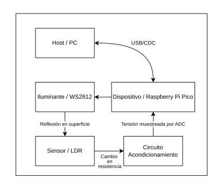
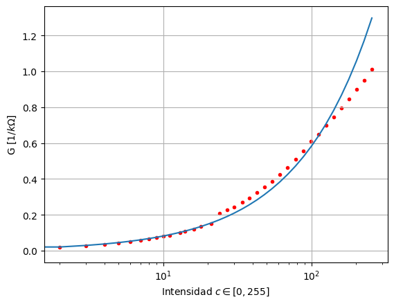
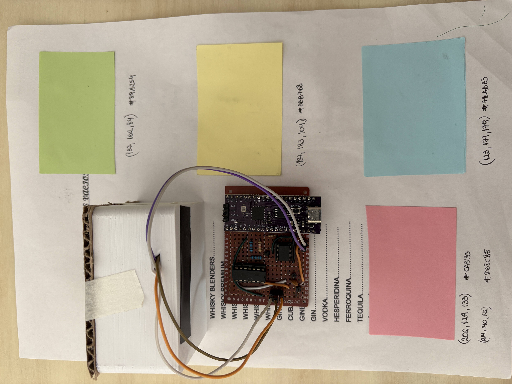
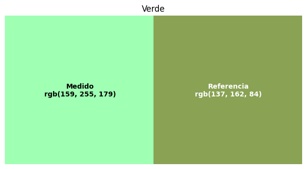
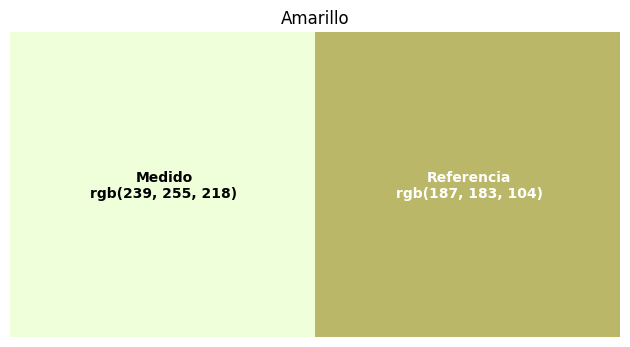
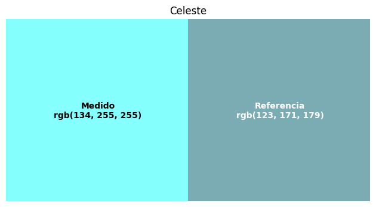
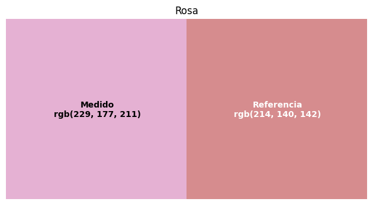

# Sensor de Colores por Reflexión

Este proyecto consiste en el diseño e implementación de un **sensor de color de bajo costo** capaz de estimar el color de una superficie y representarlo en formato RGB de 24 bits. El sistema utiliza una fotorresistencia (LDR) como transductor principal, compensando sus limitaciones mediante un proceso de caracterización empírica y un circuito de acondicionamiento activo.

## Características Principales
* **Hardware:** Basado en el microcontrolador **RP2040** (Raspberry Pi Pico).
* **Iluminantes:** LEDs RGB direccionables **WS2812**, controlados mediante el hardware PIO del RP2040 para máxima precisión.
* **Acondicionamiento:** Circuito de ganancia programable utilizando el switch bilateral **CD4066**, permitiendo medir un amplio rango de resistencias del LDR (1 k&Omega; a 1 M&Omega;) sin saturación.
* **Software:** Firmware desarrollado en C con **FreeRTOS** y **TinyUSB**. Aplicación de control en Python (CLI) para procesamiento de datos.

## Principio de Funcionamiento

El sensor opera utilizando la **reflexión secuencial**. El proceso se divide en los siguientes pasos:

1. **Aislamiento:** La carcasa diseñada bloquea la luz ambiente para evitar interferencias en la medición.
2. **Iluminación:** El dispositivo enciende secuencialmente los canales Rojo, Verde y Azul de los LEDs.
3. **Detección:** El LDR recibe la luz reflejada por la superficie. Su resistencia cambia según la intensidad recibida, y el circuito de acondicionamiento convierte este cambio en una tensión medible por el ADC.
4. **Procesamiento:** El microcontrolador envía los valores a una PC vía USB (CDC), donde se calcula el color final aplicando los parámetros de calibración.

## Caracterización y Calibración del LDR

Dado que los LDR presentan baja trazabilidad y una respuesta no lineal que varía según la longitud de onda , se implementó un procedimiento de **calibración por mínimos cuadrados**.

### El Modelo
Se modela la conductancia ($G$) del LDR en función de la intensidad de la luz ($c$) mediante la ecuación:
$$G = K_a c^{\gamma}$$
Donde $K_a$ y $\gamma$ son parámetros específicos para cada color y cada componente individual.

### Proceso de Calibración
1. Se realiza un **barrido logarítmico de intensidad** (de 0 a 255) para cada canal (R, G, B) sobre una superficie blanca de referencia.
2. Se recolectan las muestras de tensión y se ajusta automáticamente la ganancia ($R_f$) para mantener la señal en la zona lineal del ADC.
3. Mediante un script de Python, se aplica la técnica de **mínimos cuadrados** sobre los datos para hallar los coeficientes $K_a$ y $\gamma$ para cada color por separado.
4. Estos coeficientes se guardan en un archivo JSON que la aplicación CLI utiliza para convertir las mediciones posteriores en códigos de color precisos.

## Estructura del Repositorio
* `/firmware`: Código fuente en C para el RP2040 (Pico-SDK).
* `/scripts`: Contiene la Aplicación CLI en Python y varios scripts de procesamiento de datos.
* `/hardware`: Modelado de las carcasas del dispositivo para impresión 3D.
* `/circuitos`: Esquemáticos del circuito de acondicionamiento y simulaciones en LTSpice.
* `/docs`: Informes técnicos detallados del proyecto.

## Resultados

Utilizando la siguiente hoja de prueba, se tomaron medidas de las superficies de color utilizando distintas aplicaciones móviles, bajo distintas condiciones de iluminación ambiente, y se compararon con las medidas obtenidas con el dispositivo.

---

- **Autores:** Federico Beck & Mariano Perez 
- **Institución:** Universidad Tecnológica Nacional - Facultad Regional San Francisco.

Entregado como trabajo integrador de las materías Médidas Electrónicas II y Técnicas Digitales III.